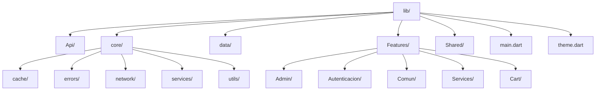
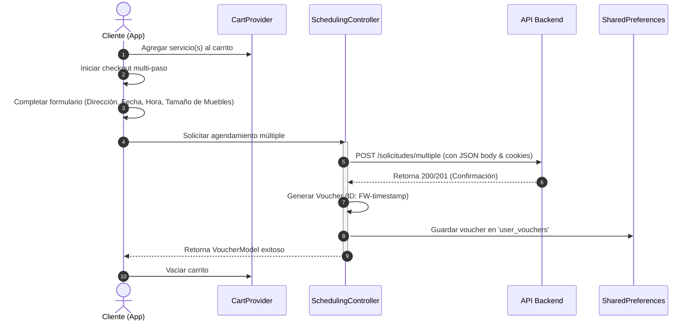

# Documentación Técnica Completa: Proyecto Móvil FoamWash

Este documento describe de manera exhaustiva la arquitectura, estructura de código, servicios clave, integraciones y flujos de negocio del proyecto móvil **FoamWash** (desarrollado en **Flutter**).

---

## 1. Información General del Proyecto

- **Nombre del Proyecto:** FoamWash (comercialmente relacionado con "Lavados González").
- **Framework & SDK:** Flutter ^3.11.5 (Dart SDK ^3.11.5).
- **Propósito:** Aplicación móvil orientada al agendamiento, cotización y gestión de servicios profesionales de limpieza de mobiliario a domicilio (colchones, sofás, alfombras, sillas de comedor, etc.).
- **Roles de Usuario Soportados:**
  - **Administrador (Admin):** Panel de control con visualización de KPIs (ingresos, reservas totales/pendientes, cantidad de clientes), gestión de reservas asignadas y agenda general, administración de empleados, usuarios, servicios y visualización de reportes de negocio.
  - **Empleado (Trabajador):** Consulta de agenda de servicios asignados, actualización de estado del servicio y métricas de desempeño personal.
  - **Cliente / Invitado:** Exploración interactiva del catálogo de servicios, carrito de compras multi-servicio, flujo de agendamiento detallado (dirección, tamaño del mueble, fecha, hora) con persistencia local de vouchers de reserva generados.

---

## 2. Arquitectura y Estructura de Directorios

La aplicación sigue una arquitectura limpia estructurada por **Capas** y **Features** (Características). A continuación, se presenta el mapa detallado del directorio de código fuente (`lib/`):

### Tabla de Desglose de Archivos Clave

| Directorio | Archivo | Propósito / Descripción |
| :--- | :--- | :--- |
| **Api/** | `api_constants.dart` | Almacena la URL base del servidor (`baseUrl`) y las rutas de los endpoints (reservas, autenticación, empleados, etc.). |
| **core/cache/** | `secure_storage_service.dart` | Envoltura encriptada sobre `flutter_secure_storage` para guardar de forma segura tokens JWT y cookies de sesión. |
| | `hive_cache.dart` / `cache_service.dart` | Mecanismos de almacenamiento local en caché rápido mediante la base de datos Hive y abstracción de memoria. |
| **core/network/**| `api_client.dart` | Cliente HTTP centralizado (Dio / Http) que inyecta automáticamente cabeceras de autorización y cookies de sesión en las peticiones. |
| | `connectivity_service.dart` | Monitorea activamente si el dispositivo móvil cuenta con conexión activa a internet. |
| **core/services/**| `fcm_service.dart` | Administra la inicialización, suscripción a temas y enrutamiento dinámico al pulsar notificaciones push de Firebase (FCM). |
| **core/utils/** | `security_utils.dart` | Implementa protección de interfaz de usuario mediante prevención de capturas y grabaciones de pantalla (`no_screenshot`). |
| **Features/Comun/**| `Index.dart` | Vista principal del cliente. Incluye un fondo animado, slider de imágenes locales de servicios, accesos directos y un modal para contacto por WhatsApp. |
| **Features/Autenticacion/**| `login_screen.dart` / `register_screen.dart` | Interfaces para inicio de sesión y registro de cuentas de usuario. |
| | `providers/auth_provider.dart` | Gestor del estado de autenticación (identificación de usuario, obtención del rol y cierre de sesión). |
| **Features/Services/**| `views/scheduling_view.dart` | Formulario dinámico de reserva de citas. |
| | `controllers/scheduling_controller.dart` | Controlador que maneja la comunicación con el backend para programar servicios individuales o múltiples (`/solicitudes/multiple`). |
| **Features/Cart/** | `providers/cart_provider.dart` | Proveedor del estado del carrito de compras (agregar, eliminar, limpiar y calcular total de servicios seleccionados). |
| | `views/cart_view.dart` / `checkout_step_views` | Pantallas para el listado de servicios agregados y pasos interactivos de facturación y dirección de entrega. |
| **Features/Admin/** | `views/admin_dashboard_view.dart` | Dashboard administrativo con KPIs financieros, últimas reservas y lista de empleados activos. |

---

## 3. Servicios Clave e Integraciones

### 3.1. Notificaciones Push (Firebase Cloud Messaging + Local Notifications)
El archivo [fcm_service.dart](file:///c:/FoamWash/foamwash/lib/core/services/fcm_service.dart) orquesta la comunicación en tiempo real con Firebase:
- **Ejecución en segundo plano:** En `main.dart`, se declara `_firebaseMessagingBackgroundHandler` bajo la anotación `@pragma('vm:entry-point')` para procesar notificaciones aún si la aplicación está cerrada.
- **Suscripción dinámica a temas (Topics):**
  - Al iniciar sesión con éxito, el dispositivo se suscribe automáticamente a temas genéricos de rol (ej: `topic_admin`, `topic_employee`, `topic_client`) y a un tema privado específico de usuario (`user_ID`). Esto permite segmentar el envío de alertas desde el backend.
  - Al cerrar sesión, se realiza la desuscripción de todos estos temas.
- **Notificaciones en Primer Plano (Foreground):** El paquete `flutter_local_notifications` muestra alertas de manera local cuando la app está abierta, utilizando un canal de alta importancia (`high_importance_channel`).
- **Enrutamiento Inteligente:** Al pulsar una notificación, se redirige dinámicamente:
  - `reporte_semanal` $\rightarrow$ Redirecciona al panel de reportes de administración (`/admin_reportes`).
  - `nueva_reserva` / `reserva_cancelada` $\rightarrow$ Envía al panel de reservas (`/admin_agenda` para administradores) o a la agenda del cliente (`/scheduling`).

### 3.2. Seguridad Avanzada y Almacenamiento Seguro
- **Protección de Datos Sensibles:** La clase `SecureStorageService` gestiona de forma segura el ciclo de vida de las credenciales y tokens del usuario. Adicionalmente a las cabeceras estándar de autenticación `Bearer Token`, se inyectan las cookies del backend (`Cookie`) en cada petición al API cliente para evitar fallos de tipo *401 Unauthorized*.
- **Prevención de Capturas de Pantalla:** A través de `SecurityUtils.secureScreen()`, las pantallas sensibles de administración (como el Dashboard o la lista de usuarios y reportes financieros) activan banderas del sistema operativo móvil para bloquear capturas de pantalla o grabaciones en video del dispositivo, protegiendo así la información empresarial.

### 3.3. Sistema de Diseño Visual y Temas
- **Tipografía:** Se utiliza la fuente premium **Kanit** (cargada localmente con variaciones de peso de `400` a `900`).
- **Colores Principales:**
  - Azul Corporativo: `0xFF1A56FF` (`AppTheme.primaryBlue`).
  - Azul Suave (Acentos): `0xFF7EB8FF`.
  - Fondo de Navegación Oscuro: `0xFF0A1437` o `0xD90A1437`.
  - Fondo Claro de Interfaces: `0xFFF4F7FF`.

---

## 4. Flujos Clave de Negocio

### 4.1. Flujo de Compra y Agendamiento Multi-servicio (Cliente)

El proceso desde que un usuario cliente explora los servicios hasta que recibe su voucher de confirmación sigue los siguientes pasos lógicos:

---

## 5. Gestión del Estado de la Aplicación

El estado de la aplicación se centraliza en `main.dart` utilizando el patrón **Provider**. Los estados principales expuestos reactivamente a las pantallas son:

1. **AuthProvider:** Mantiene el estado del usuario activo, verifica periódicamente la validez de la sesión local, gestiona el inicio/cierre de sesión y proporciona variables booleanas útiles como `isAdmin` o `isAuthenticated`.
2. **ServicesProvider:** Encargado de cargar de manera reactiva el catálogo de servicios de limpieza ofrecidos por la empresa desde la base de datos externa.
3. **CartProvider:** Almacena temporalmente los servicios seleccionados para contratación y recalcula dinámicamente los subtotales y totales financieros del cliente.
4. **EmpleadosProvider & UsuariosProvider:** Encargados de suministrar y modificar reactivamente la información de personal y cuentas del sistema en los módulos administrativos correspondientes.
